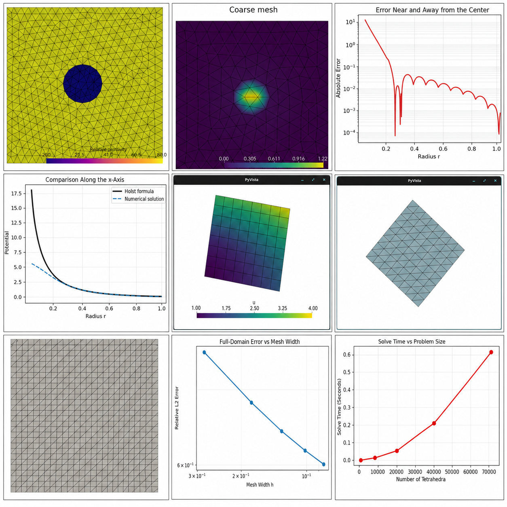

# Finite Element Ion Channel Modeling



## Description

A set of finite-element experiments exploring the Poisson equation and the
linearized Poisson-Boltzmann equation in the context of ion channel modeling.
The project progresses from a manufactured-solution Poisson benchmark to a
three-dimensional screened-potential problem and a two-domain model with
different dielectric values for the protein and solvent regions.

**Stack:** Python | FEniCSx | Gmsh | UFL | MPI | NumPy | Matplotlib | PyVista

For the full mathematical discussion, read the two papers in the
[Google Drive folder](https://drive.google.com/drive/folders/1dkOa-wnW3BBUInCp_A_2ZXw6GaKBVa_0?usp=drive_link).

## Motivation

Electrostatic potential is central to understanding how ions move through
channel proteins. The geometry is irregular, material properties change across
interfaces, and ionic screening matters in the surrounding solvent. This
project uses finite-element methods to move from the underlying Poisson
equation toward a simplified numerical model of those effects.

## Quick Start

Create and activate the Conda environment:

```bash
conda env create -f environment.yml
conda activate finite-element-ion-channel-modeling
```

Run the introductory Poisson benchmark:

```bash
python poisson_fundamentals.py
```

Run the linearized Poisson-Boltzmann experiments:

```bash
python poisson_boltzmann.py
```

Generated meshes, plots, summaries, and solver output are written to
`results/`.

## Experiments

- `poisson_fundamentals.py` verifies the finite-element implementation against
  a manufactured Poisson solution and studies mesh refinement.
- `poisson_boltzmann.py` compares a screened Coulomb potential against a
  Gaussian-source approximation and solves a two-domain ion-channel model.
- `poisson_boltzmann_matrix.png` collects the main numerical results and
  convergence figures in one overview image.

## Papers

The accompanying papers are available in this
[Google Drive folder](https://drive.google.com/drive/folders/1dkOa-wnW3BBUInCp_A_2ZXw6GaKBVa_0?usp=drive_link):

- *The Poisson Equation and Its Role in Ion Channel Modeling*
- *A Poisson Boltzmann Numerical Experiment*

## Repository History

The original local Git metadata was lost. The March-April 2026 commit sequence
in this repository was reconstructed from the surviving project artifacts to
preserve the original development timeline.

## Author

Built by Brandon Connely.
